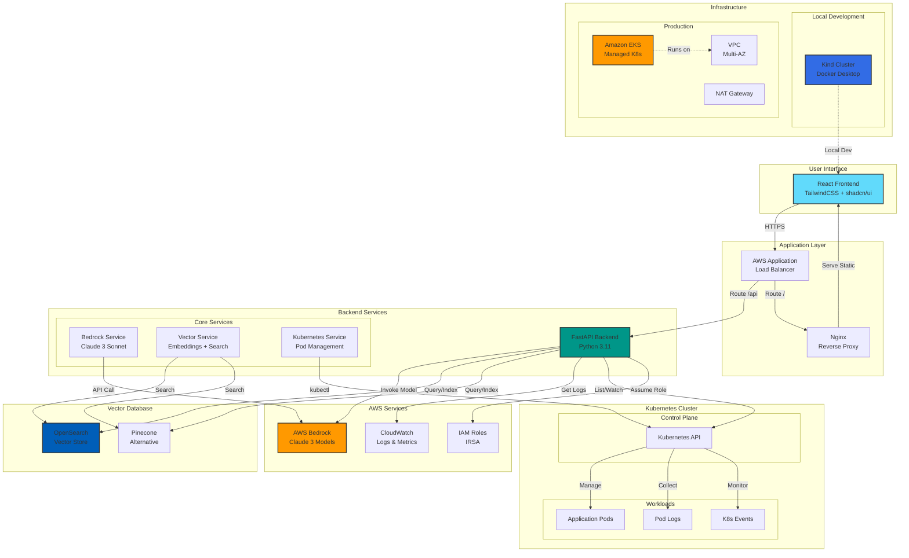
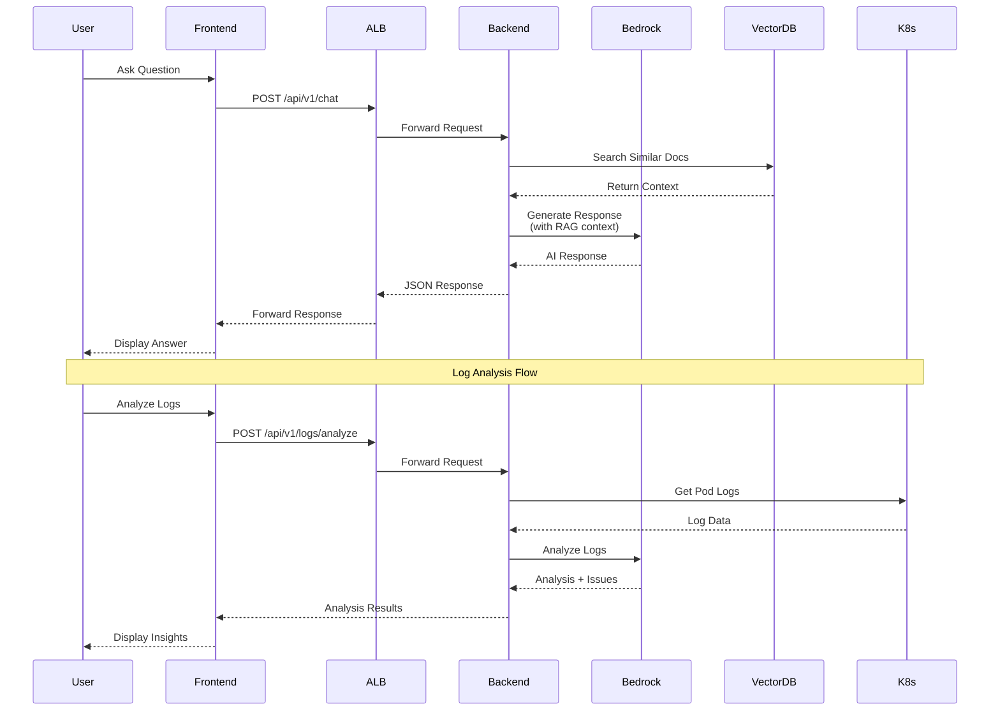
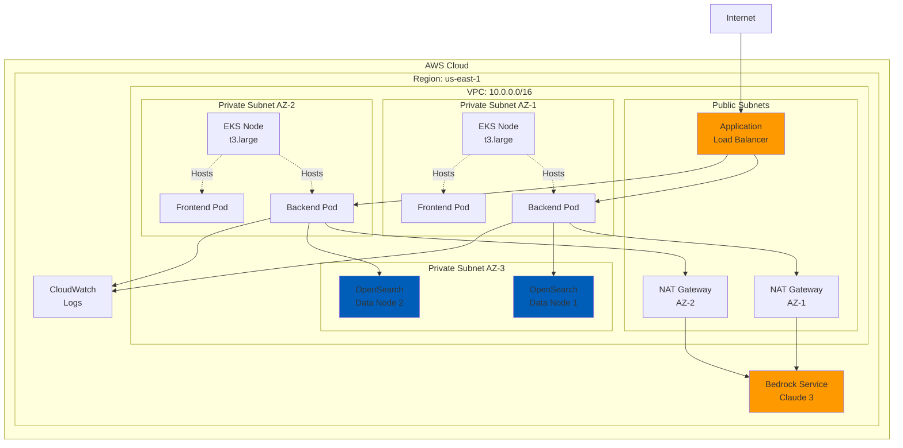
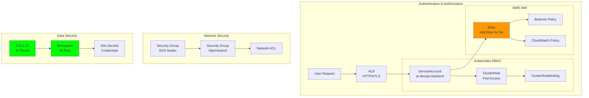
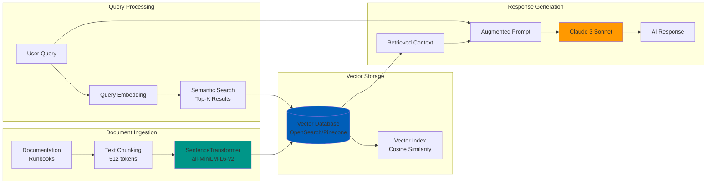
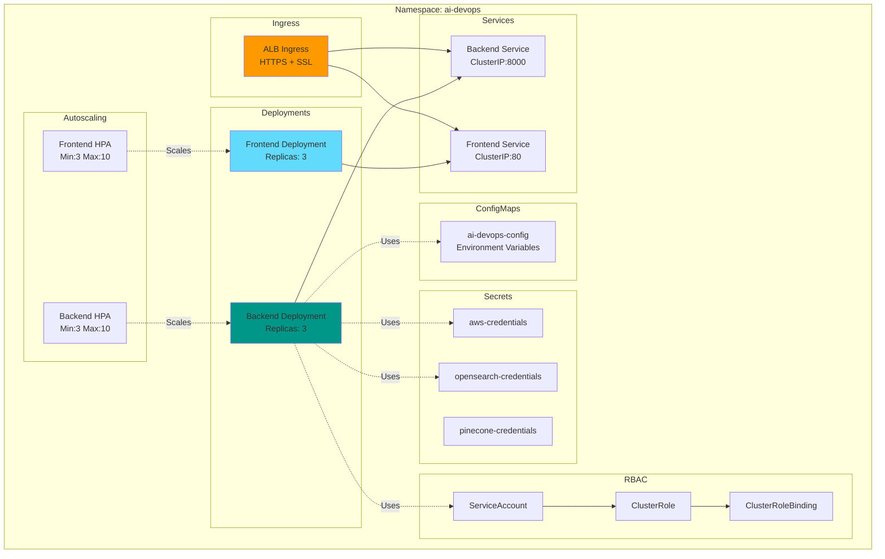
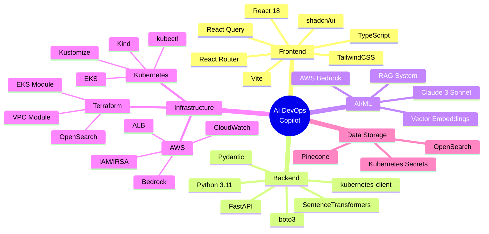

# AI DevOps Copilot - Architecture

## System Architecture Diagram



## Data Flow Diagram



## Component Architecture

```mermaid
graph LR
    subgraph "Frontend Components"
        CHAT[Chat Page]
        LOGS[Logs Page]
        GEN[Generate Page]
        ANALYZE[Analyze Page]
        LAYOUT[Layout Component]
    end

    subgraph "API Endpoints"
        CHAT_API[/api/v1/chat]
        LOGS_API[/api/v1/logs]
        GEN_API[/api/v1/generate]
        RCA_API[/api/v1/analyze]
        HEALTH[/api/v1/health]
    end

    subgraph "Backend Services"
        BEDROCK_SVC[BedrockService]
        VECTOR_SVC[VectorService]
        K8S_SVC[KubernetesService]
    end

    CHAT --> CHAT_API
    LOGS --> LOGS_API
    GEN --> GEN_API
    ANALYZE --> RCA_API
    
    CHAT_API --> BEDROCK_SVC
    CHAT_API --> VECTOR_SVC
    LOGS_API --> K8S_SVC
    LOGS_API --> BEDROCK_SVC
    GEN_API --> BEDROCK_SVC
    RCA_API --> BEDROCK_SVC
    RCA_API --> K8S_SVC
    
    style CHAT fill:#61dafb
    style LOGS fill:#61dafb
    style GEN fill:#61dafb
    style ANALYZE fill:#61dafb
```

## Deployment Architecture



## Security Architecture



## RAG System Architecture



## Kubernetes Resource Hierarchy



## Technology Stack



## CI/CD Pipeline (Future)

```mermaid
graph LR
    subgraph "Source Control"
        GIT[GitHub<br/>Repository]
        PR[Pull Request]
    end
    
    subgraph "CI Pipeline"
        LINT[Linting<br/>ESLint/Black]
        TEST[Unit Tests<br/>Pytest/Jest]
        BUILD[Build Images<br/>Docker]
    end
    
    subgraph "CD Pipeline"
        PUSH[Push to ECR]
        DEPLOY_DEV[Deploy to Dev<br/>Kind]
        DEPLOY_PROD[Deploy to Prod<br/>EKS]
    end
    
    subgraph "Monitoring"
        HEALTH_CHECK[Health Checks]
        ROLLBACK[Auto Rollback]
    end
    
    GIT --> PR
    PR --> LINT
    LINT --> TEST
    TEST --> BUILD
    BUILD --> PUSH
    PUSH --> DEPLOY_DEV
    DEPLOY_DEV --> DEPLOY_PROD
    DEPLOY_PROD --> HEALTH_CHECK
    HEALTH_CHECK -->|Failure| ROLLBACK
    
    style BUILD fill:#2088ff
    style DEPLOY_PROD fill:#28a745
```



## Key Features & Capabilities

| Feature | Technology | Purpose |
|---------|-----------|---------|
| **AI Chat** | Claude 3 Sonnet | Natural language infrastructure queries |
| **RAG System** | OpenSearch + Embeddings | Context-aware responses from docs |
| **Log Analysis** | Kubernetes API + Bedrock | Intelligent log parsing and insights |
| **Code Generation** | Bedrock | Generate IaC, K8s manifests, CI/CD |
| **RCA** | Bedrock + K8s Events | Root cause analysis for incidents |
| **Scalability** | HPA + Multi-AZ | Auto-scaling based on load |
| **Security** | IRSA + RBAC + TLS | Secure access to AWS and K8s |
| **Observability** | CloudWatch + Metrics | Monitoring and alerting |

